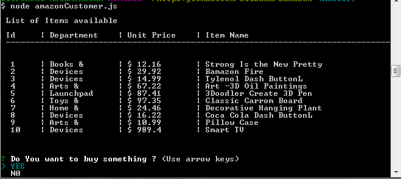
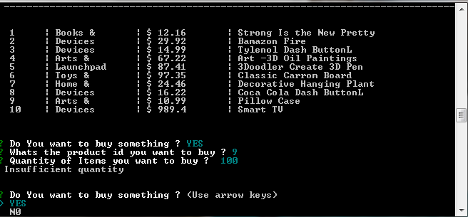
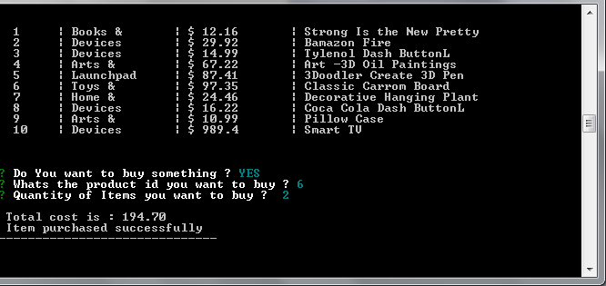
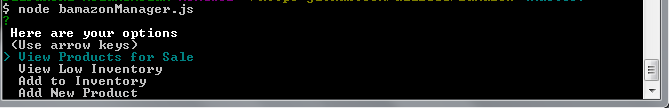
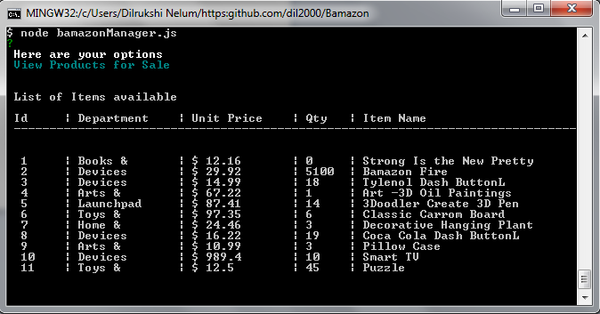
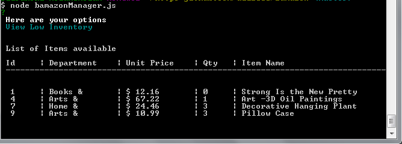
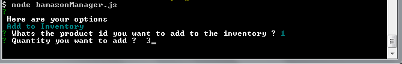

# Bamazon :dizzy:
## Amazon-like storefront ##

This application will take in orders from customers and deplete stock from the store's inventory. 
Major component of this project are - MySQL Database called `bamazon`, Javascript called - amazonCustomer.js which connects the database and populate the results.

#### How to Use the app :running:

Identify the user mode - Customer View - amazonCustomer.js or the Manager View - bamazonManager.js

- - -

### If its the Customer then :information_desk_person:

    * ask the ID of the product they would like to buy.
    * ask how many units of the product they would like to buy.

 

If the quantity of products requested not available in the in the inventory it logs - insuffient quantity and continue the transaction.
    

 

After entering those details system checks for the product availability and if its avaialble calculate the final cost and remove the    products from the inventory.
	

- - -
    
### If its the Manager View :japanese_goblin:

Options Available are
    1 View Products for Sale
    2 View Low Inventory
    3 Add to Inventory
    4 Add New Product

 

1. View Products for Sale

Will display all the products available in the inventory.

 

2. View Low Inventory

This option will list all items in the inventory count lower than five.

 

3 Add to Inventory

Prompt and will let the manager "add more" of any item currently in the store. Manager has to enter the product ID followed by the quantitiy wants to add.

 

4 Add New Product

After selecting this option manager can add a completely new product to the store.

 

If the product entered successfully the below text will appear in the console.

 

